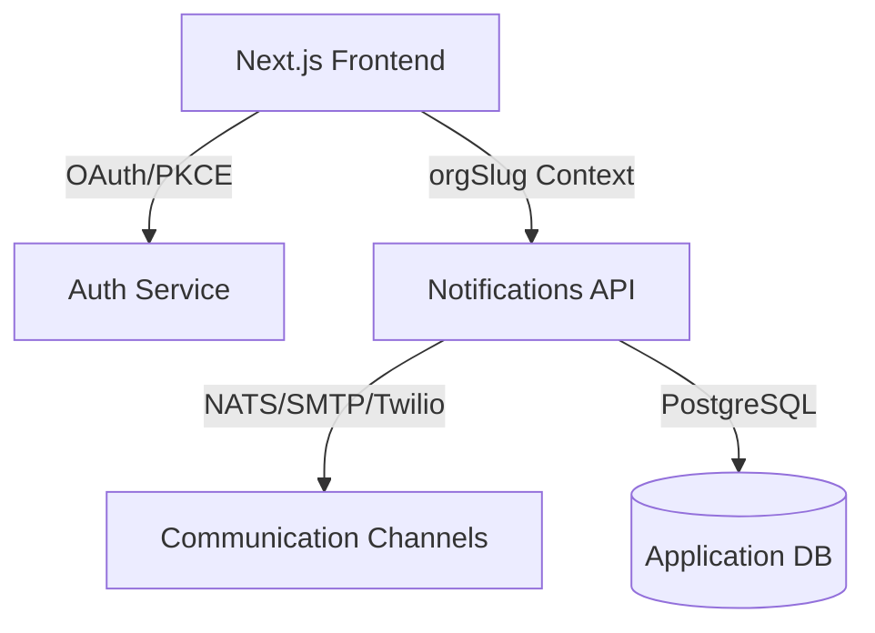

# Architecture Overview

## Design Philosophy
The Notifications UI is built as a high-performance, multi-tenant "Command Center" that provides a unified interface for complex communication workflows.

## Core Pillars

### 1. Multi-tenant Context Isolation
Strict tenant isolation is achieved through dynamic routing using the `[orgSlug]` pattern.
- **Root Redirect**: `/` redirects to the default organization (e.g., `/codevertex`).
- **Context Injection**: Each page retrieves its context from the `orgSlug` parameter, ensuring that API calls and branding are strictly scoped to the current organization.

### 2. Modern Server Components (Next.js 16)
Leveraging the latest Next.js 16 features for optimal performance:
- **Asynchronous Params**: All server components await their route parameters, ensuring thread-safe data fetching.
- **Standalone Output**: Optimized for containerized deployments in Kubernetes clusters.

### 3. Progressive Web App (PWA)
A full-stack PWA implementation using `@ducanh2912/next-pwa`:
- **Manifest**: Branded with high-resolution SVG assets and theme colors.
- **Custom Service Worker**: Handles background `push` events, display of notifications, and deep-linking back into the application.

### 4. Real-time Branding Engine
A dynamic styling pipeline that allows organization admins to customize the interface without code changes:
- **BrandingProvider**: A React context that fetches tenant-specific styles and injects them as CSS variables.
- **Live Preview**: Real-time rendering of theme changes in the settings module.

## Data Flow

